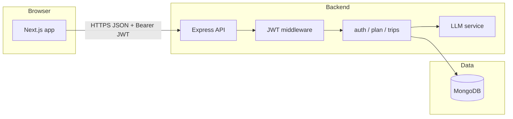

# AI Travel Planner

## Project overview

AI Travel Planner is a full-stack web app that helps signed-in users generate multi-day itineraries for a destination, see a rough INR budget breakdown and hotel ideas, and refine plans over time. Users can create trips from a structured “plan” chat flow or a classic form, regenerate individual days with natural-language instructions, add or remove activities, and browse or restore earlier versions of a trip via revision history.

The repository is a **monorepo** with a **Next.js** frontend (`frontend/`) and an **Express + MongoDB** backend (`backend/`).

## Tech stack (and why)

| Layer | Choice | Rationale |
|--------|--------|-----------|
| **Frontend** | Next.js (App Router), React 19, TypeScript | Server/client components, routing, and a mature ecosystem for a product-style UI. |
| **UI** | Mantine v8 | Accessible components, theming, forms, and notifications with less bespoke CSS. |
| **Backend** | Express 5, TypeScript | Simple HTTP API, easy to deploy as a long-lived Node service next to MongoDB. |
| **Data** | MongoDB via Mongoose | Document model fits nested itineraries, budgets, and revision snapshots without heavy joins. |
| **Auth** | Email/password + bcrypt + JWT | Stateless API auth suitable for SPA clients; no session store required on the server. |
| **AI** | OpenAI SDK (`openai` package) against an OpenAI-compatible chat API | One client supports OpenAI, proxies, or Google’s Gemini OpenAI-compat endpoint; responses are validated with **Zod** after JSON extraction. |

If your course or team expected a different stack (e.g. Nest, Prisma, or a serverless-only design), the trade-off here favors a small, explicit Express API and Mongoose for speed of iteration and clear ownership of trip/revision documents.

## Setup instructions

### Prerequisites

- **Node.js** (LTS recommended)
- **MongoDB** — local instance or [MongoDB Atlas](https://www.mongodb.com/cloud/atlas) connection string

### Local development

1. **Clone the repo** and open the project root.

2. **Backend**

   ```bash
   cd backend
   cp .env.example .env
   ```

   Edit `.env`:

   - `MONGODB_URI` — your Mongo connection string  
   - `JWT_SECRET` — a long random string (never commit real secrets)  
   - `OPENAI_API_KEY` — key for your chosen LLM provider  
   - `CORS_ORIGIN` — e.g. `http://localhost:3000` (comma-separated for multiple origins; `*` allows all, not recommended for production)

   Optional LLM tuning (see `backend/src/services/llm.ts`): `OPENAI_BASE_URL` / `LLM_BASE_URL`, `LLM_MODEL_FALLBACKS`, `GEMINI_API_KEY` (fallback when the primary host returns 404 for all models), etc.

   ```bash
   npm install
   npm run dev
   ```

   API defaults to **port 4000**. Health check: `GET http://localhost:4000/api/health`.

3. **Frontend**

   ```bash
   cd frontend
   cp .env.example .env.local
   ```

   Set `NEXT_PUBLIC_API_URL` to your API origin (e.g. `http://localhost:4000`).

   ```bash
   npm install
   npm run dev
   ```

   App defaults to **port 3000**.

4. **Usage flow**: sign up or log in, open the dashboard, use **Plan** or **New trip** to generate a trip, then open a trip to edit days, view revisions, or restore a snapshot.

### Deployed setup (high level)

There is no single prescribed host in-repo; a typical layout:

1. **Database**: MongoDB Atlas cluster; copy the SRV URI into the backend’s `MONGODB_URI`.
2. **Backend**: Deploy `backend/` to any Node host (Railway, Render, Fly.io, a VPS, etc.). Set the same env vars as production, especially `JWT_SECRET`, `MONGODB_URI`, `OPENAI_API_KEY`, and `CORS_ORIGIN` to your **exact** frontend origin(s).
3. **Frontend**: Deploy `frontend/` to Vercel (or similar). Set `NEXT_PUBLIC_API_URL` to the **public HTTPS URL** of the API (no trailing slash required for how the client builds paths).

Build commands:

- Backend: `npm run build` then `npm start` (runs `dist/index.js`).
- Frontend: `npm run build` then `npm start` (or use the platform’s Next.js preset).

Ensure the API allows **HTTPS** from the browser and that **CORS** includes your deployed frontend URL.

## High-level architecture



- **Frontend** calls REST endpoints under `/api/*` with `Authorization: Bearer <token>` where required (`frontend/src/lib/api.ts`).
- **Backend** mounts routers: `/api/auth`, `/api/plan`, `/api/trips` (`backend/src/index.ts`).
- **Persistence**: `User`, `Trip`, and `TripRevision` collections (Mongoose models in `backend/src/models/`).
- **AI**: All model calls go through `backend/src/services/llm.ts` (chat completions, JSON parse + Zod validation, retries on bad JSON / rate limits).

## Authentication and authorization

- **Registration** (`POST /api/auth/signup`): email (unique, lowercased), password (min length enforced), names; password stored as **bcrypt** hash.
- **Login** (`POST /api/auth/login`): returns a **JWT** (default expiry 7 days) with `userId` in the payload.
- **Protected routes**: `requireAuth` middleware reads `Authorization: Bearer …`, verifies with `JWT_SECRET`, and sets `req.userId` (`backend/src/middleware/auth.ts`).
- **Resource access**: Trip and revision queries always scope by `userId` (e.g. `Trip.findOne({ _id, userId })`), so users cannot read or mutate another user’s trips by ID guessing.
- **Frontend**: Token is stored client-side and attached to API calls; `RequireAuth` wraps dashboard/trip views and redirects unauthenticated users (`frontend/src/components/Auth/RequireAuth.tsx`).

**Not implemented**: OAuth/social login buttons are UI-only (“coming soon”); password reset is not backed by email on the server yet (the forgot-password page is forward-looking).

## AI agent design and purpose

The system uses **two complementary LLM flows**, both implemented in `backend/src/services/llm.ts`:

1. **Trip generation agent** (`generateTrip` / `regenerateDay`)  
   - **Purpose**: Produce structured **JSON** only: day-by-day activities (with stable string `id`s), an INR budget object, and 3–5 hotel suggestions.  
   - **Method**: System + user prompts, `callWithRetry` with Zod schemas (`TripGenerationSchema`, `RegenerateDaySchema`), and automatic correction prompts if parsing fails.  
   - **Resilience**: OpenAI-compatible client with optional model fallbacks, 429 retries, and optional **Gemini** fallback when the primary base URL returns 404 for every model.

2. **Plan assistant agent** (`planAssistantResponse`, exposed as `POST /api/plan/chat`)  
   - **Purpose**: Drive a **multi-phase conversational UX** (welcome, “new trip”, inspiration, hidden gems, adventure paths, validation phases, and a handoff to generation).  
   - **Method**: Each request sends a **phase** id (`PLAN_CHAT_PHASES`), optional user text, and a string-keyed **context** object; the model returns JSON `{ message, suggestions }` validated by `PlanChatResponseSchema`. Some phases require exactly **three** `{ label, value }` suggestion chips for destinations.  
   - **Temperature**: Slightly higher than trip JSON (`0.55`) for more natural copy while still constraining output format.

Together, the plan assistant **collects intent**; the trip generator **materializes** the plan as durable, editable data in MongoDB.

## Creative / custom feature: trip revision history

The standout custom feature is **versioned trip history with restore**:

- Every significant change creates a `TripRevision` document: initial create, day regeneration, add/remove activity, and before a restore (`backend/src/routes/trips.ts`).
- Each revision stores a full **snapshot** of the trip (destination, days, interests, itinerary, budget, hotels).
- The API exposes:
  - `GET /api/trips/:tripId/revisions` — list revisions for that user’s trip  
  - `POST /api/trips/:tripId/revisions/:revisionId/restore` — restore the trip to that snapshot (and record a new revision capturing the pre-restore state)

This gives users a **practical undo timeline** for AI and manual edits without a separate diff engine—snapshots favor clarity and implementation speed over minimal storage.

## Key design decisions and trade-offs

| Decision | Trade-off |
|----------|-----------|
| **JWT in the SPA** | Simple and scalable for the API; token theft via XSS is a risk mitigated by normal web hygiene (no token in URLs, HTTPS in production). |
| **LLM output as strict JSON + Zod** | Reliable structure for the UI and DB; occasional retries/latency vs. free-form markdown that would be harder to render and edit. |
| **INR-focused prompts** | Consistent budget UX for an India-market framing; less ideal for users who need other currencies without prompt/UI changes. |
| **Heuristic budget recalc** on activity add/remove | Keeps totals in sync without re-calling the LLM; numbers are approximate (per-activity cost by budget tier), not quote-accurate. |
| **Revision snapshots (full document)** | Easy restore and audit; MongoDB storage grows with edit frequency vs. storing only deltas. |
| **OpenAI-compatible abstraction** | Provider flexibility; behavior depends on third-party uptime, rate limits, and model availability. |

## Known limitations

- **LLM quality and facts**: Itineraries and hotels are **suggestions**, not verified bookings; opening hours, prices, and routes may be wrong or outdated.
- **No role-based authorization**: Beyond “this user owns this trip,” there are no admin or shared-trip roles.
- **Social login / email reset**: Not wired to real OAuth or transactional email.
- **Currency**: Generation is oriented toward **INR**; the UI may format amounts in INR—multi-currency would need backend and prompt changes.
- **Rate limits and costs**: Heavy use of chat completion APIs can hit quotas; the code mitigates some 429s but cannot guarantee availability.
- **Security hardening**: Production should use strong `JWT_SECRET`, tight `CORS_ORIGIN`, TLS everywhere, and regular dependency updates—this README does not replace a threat model review.

---

For Next.js-specific defaults, see `frontend/README.md`.
